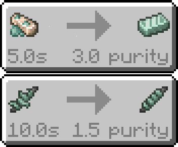

# Item Transformation

Item transformation works by shooting lasers at items to transform them into other items.

Some recipes may require a certain level of purity so be sure to check before crafting.

Next: [Mixer Machine](https://moddedmc.org/en/mod/1107394/docs/laser_chemistry/mixer)